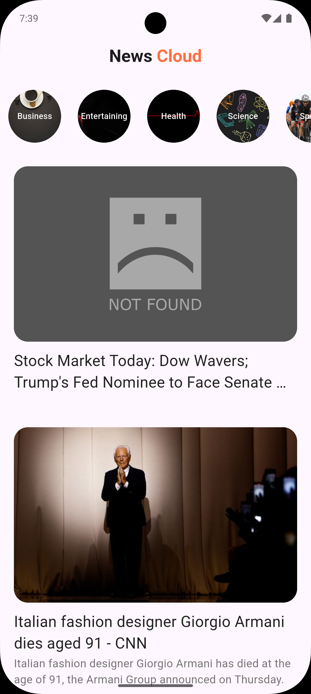

# My News

**My News** is a modern Flutter application designed to keep you updated with real-time news from around the world. Get instant access to the latest headlines across a variety of categories including Technology, Sports, Economy, Entertainment, Health, and more—all in one place!

## Features

- ⚡ **Real-time Updates:** Stay informed with the latest news as it happens.
- 🗂️ **Multiple Categories:** Explore news from various sections like Tech, Sports, Economy, Health, Entertainment, and more.
- 🎨 **User-Friendly Interface:** Enjoy a clean, intuitive, and easy-to-navigate design.
- ⭐ **Personalized Experience:** Choose your favorite categories and get news tailored to your interests.
- 🔄 **Seamless Navigation:** Effortlessly switch between categories and articles.
- 📱 **Responsive Design:** Optimized for smartphones and tablets.

## Screenshots



<!-- Add screenshots of your app here -->
<!--  -->

## Getting Started

To run this project locally:

1. **Clone the repository:**
   ```bash
   git clone https://github.com/AhmedAbdElrahman117/news_app.git
   ```
2. **Navigate to the project directory:**
   ```bash
   cd news_app
   ```
3. **Install dependencies:**
   ```bash
   flutter pub get
   ```
4. **Run the app:**
   ```bash
   flutter run
   ```

## Dependencies

This project uses the following packages:

- [`dio`](https://pub.dev/packages/dio): ^5.4.2+1 — Powerful HTTP client for Dart/Flutter.
- [`webview_flutter`](https://pub.dev/packages/webview_flutter): ^4.7.0 — Display web content within your app.
- [`font_awesome_flutter`](https://pub.dev/packages/font_awesome_flutter): ^10.7.0 — Icon pack based on Font Awesome for Flutter.
- [`url_launcher`](https://pub.dev/packages/url_launcher): ^6.2.5 — Launch URLs in a mobile platform.
- [`flutter_launcher_icons`](https://pub.dev/packages/flutter_launcher_icons): ^0.14.4 — Easily update your Flutter app's launcher icon.

## API

My News fetches news articles using a news API such as [NewsAPI.org](https://newsapi.org/) or any other reliable news data provider.

> **Note:** You may need to obtain an API key from your chosen news API provider and configure it in the project.

## Contribution

Contributions are welcome! If you have suggestions or find bugs, feel free to open an issue or submit a pull request.

## License

This project is licensed under the [MIT License](LICENSE).

---

Stay updated and informed with **My News**—your window to the world’s latest happenings!
